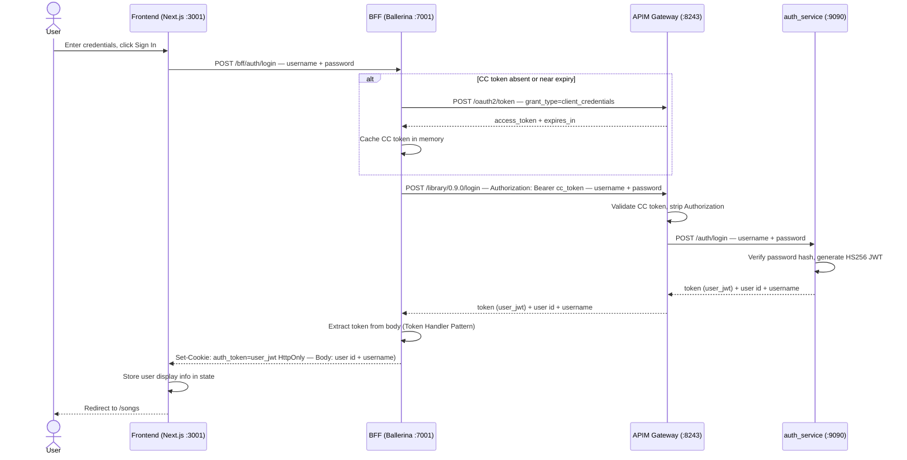
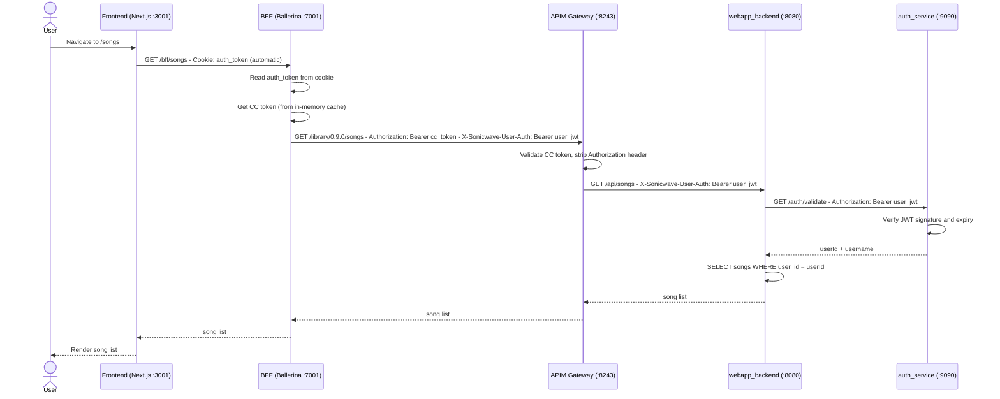

# SonicWave - BFF Pattern POC

A proof-of-concept demonstrating the **Backend for Frontend (BFF)** pattern using a real microservice stack. The application is a music library where users can register, log in, and manage their personal song collection.

The primary goal is to show how a dedicated BFF layer can sit between a browser-based frontend and an API gateway - handling authentication token management, APIM credential protection, and session security - without the frontend ever touching sensitive tokens or API manager credentials.

---

## What This POC Demonstrates

| Concern | How it is handled |
|---|---|
| APIM credentials in the browser | They are not. Credentials live only in `bff_layer/Config.toml` |
| User JWT exposure to XSS | Token is stored in an `HttpOnly` cookie, invisible to JavaScript |
| CSRF protection | `SameSite=Strict` cookie attribute |
| Dual-token APIM flow | BFF injects CC token + user JWT as separate headers |
| Stateless session scaling | Cookie carries the JWT itself - no server-side session store needed |
| Separation of concerns | Auth, songs, API management, and the browser adapter are independent services |

---

## Architecture

```
┌──────────────────────────────────────────────────────────────────┐
│  Browser                                                         │
│  SonicWave UI  (Next.js :3001)                                   │
│  • React 19 + Tailwind CSS                                       │
│  • No tokens in JavaScript - auth is httpOnly cookie-based       │
└─────────────────────────┬────────────────────────────────────────┘
                          │  HTTP  /bff/*  (same-origin, Next.js rewrite)
                          ▼
┌──────────────────────────────────────────────────────────────────┐
│  Ballerina BFF  :7001                                            │
│  • Holds APIM client credentials (never leave this process)      │
│  • Fetches and caches the APIM Client Credentials token          │
│  • Token Handler Pattern: moves user JWT → httpOnly cookie       │
│  • Injects Authorization + X-Sonicwave-User-Auth on every call   │
└─────────────────────────┬────────────────────────────────────────┘
                          │  HTTPS  /library/0.9.0/*
                          ▼
┌──────────────────────────────────────────────────────────────────┐
│  WSO2 APIM 4.4.0  :8243                                          │
│  MusicLibrary API Product                                        │
│  • Validates CC token (subscription check, rate limiting)        │
│  • Strips Authorization before forwarding to backends            │
│  • Passes X-Sonicwave-User-Auth through unchanged               │
└──────────┬──────────────────────────────┬────────────────────────┘
           │                              │
           ▼                              ▼
┌──────────────────────┐    ┌─────────────────────────────────────┐
│  auth_service  :9090 │    │  webapp_backend  :8080              │
│  Ballerina           │    │  Ballerina + SQLite                 │
│  • Register / Login  │    │  • Songs CRUD (owner-scoped)        │
│  • Validate JWT      │    │  • Calls auth_service to identify   │
│  • Issues HS256 JWTs │    │    the caller on every request      │
└──────────────────────┘    └─────────────────────────────────────┘
```

### Service map

| Service | Port | Technology |
|---|---|---|
| Frontend | 3001 | Next.js 16, React 19, Tailwind CSS |
| BFF | 7001 | Ballerina 2201.13.2 |
| APIM Gateway | 8243 | WSO2 API Manager 4.4.0 |
| APIM Management | 9443 | WSO2 API Manager 4.4.0 |
| auth_service | 9090 | Ballerina 2201.13.1, SQLite |
| webapp_backend | 8080 | Ballerina 2201.13.1, SQLite |

---

## Key Components

### Frontend - `webapp-frontend/`

A Next.js application with two responsibilities:

1. **Serve the React UI** - pages for login, register, song list, song detail, and add song
2. **Proxy `/bff/*` to the BFF** via a single Next.js rewrite rule in `next.config.ts`

The frontend has no token logic whatsoever. `src/lib/api.ts` is the entire API client - it is 60 lines, makes plain `fetch` calls with `credentials: 'include'`, and relies on the browser to attach the session cookie automatically. There are no `Authorization` headers, no `localStorage` token reads, and no APIM awareness.

### BFF - `bff_layer/`

The BFF is the security and protocol adapter. Its responsibilities are:

**Credential custody**
`apimClientId` and `apimClientSecret` are loaded from `Config.toml` at startup and never forwarded to the browser under any circumstances.

**CC token management**
On the first request (or when the cached token is near expiry), the BFF calls `POST /oauth2/token` on the APIM key manager with a Client Credentials grant. The resulting APIM JWT is cached in-process with a 60-second safety margin. All downstream calls include this token in `Authorization`.

**Token Handler Pattern**
On login and register, the BFF receives `{ token, user }` from auth_service via APIM. It takes the JWT out of the response body, places it in an `HttpOnly; SameSite=Strict` cookie, and returns only `{ user }` to the browser. From this point the token is inaccessible to JavaScript.

**Header injection**
On every authenticated request, the BFF reads the `auth_token` cookie and forwards two headers to APIM:
- `Authorization: Bearer <apim_cc_token>` - proves the application is subscribed
- `X-Sonicwave-User-Auth: Bearer <user_jwt>` - proves the user's identity

### APIM - `apim/wso2am-4.4.0/`

A single **MusicLibrary API Product** at context `/library/0.9.0` aggregates both backend services. The APIM gateway validates the CC token in `Authorization`, strips it (so backends never see APIM internals), and forwards all other headers - including `X-Sonicwave-User-Auth` - to the appropriate backend.

### auth_service - `backend/auth_service/`

Handles user registration, login, and JWT validation. Issues HS256 JWTs with a 24-hour TTL. The `/auth/validate` endpoint reads `X-Sonicwave-User-Auth` first (APIM flow, where `Authorization` has been stripped) and falls back to `Authorization` (direct service-to-service calls), making it compatible with both flows without code duplication.

### webapp_backend - `backend/webapp_backend/`

Manages song CRUD against a SQLite database. Every operation is scoped to the authenticated user: songs are owned, and a user can only list, view, and create their own songs. Auth is delegated to auth_service via the same dual-header resolution.

---

## Token & Cookie Design

### Why two tokens?

APIM and auth_service use incompatible JWT formats - different issuers and different signing keys. Neither can validate the other's token. Two separate headers let each layer validate only what it owns:

| Token | Issued by | Validated by | Purpose |
|---|---|---|---|
| APIM CC JWT (RS256) | APIM `/oauth2/token` | APIM gateway | Proves the app is subscribed; enables rate limiting |
| User JWT (HS256) | auth_service | auth_service `/validate` | Carries `userId`; scopes songs to the caller |

### Token Handler Pattern (THP)

The BFF never creates its own JWT and never inspects the JWT content. After a successful login it receives the auth_service JWT in the response body, intercepts it, and stores it in an `HttpOnly` cookie. JavaScript has zero access to the token from that point.

```
BFF response to browser on login:

  HTTP/1.1 200 OK
  Set-Cookie: auth_token=<jwt>; Path=/bff; Max-Age=86400; HttpOnly
  Content-Type: application/json

  { "user": { "id": "3", "username": "alice" } }
                ↑ token is NOT in the body
```

### Cookie properties

| Attribute | Value | Reason |
|---|---|---|
| `HttpOnly` | true | Token invisible to JavaScript; blocks XSS token theft |
| `SameSite` | Strict | Blocks cross-site request forgery |
| `Path` | `/bff` | Cookie only sent to BFF routes |
| `Max-Age` | 86400 | Matches the auth_service JWT TTL (24 hours) |
| `Secure` | not set in dev | Must be added in production (requires HTTPS end-to-end) |

### Session lifecycle

```
Register / Login  → BFF sets auth_token cookie
Page reload       → GET /bff/auth/validate → BFF reads cookie → APIM → 200 or 401
Any 401 response  → FE dispatches auth:unauthorized → user state cleared
Logout            → POST /bff/auth/logout → BFF sets Max-Age=0 → cookie deleted
```

---

## Sequence Diagrams

### Login flow



### Song viewing flow



---

## Prerequisites

| Tool | Version | Notes |
|---|---|---|
| [Node.js](https://nodejs.org/) | v22+ | Frontend runtime |
| [Ballerina](https://ballerina.io/downloads/) | 2201.13.x (Swan Lake Update 13) | BFF + backend services |
| Java | 17+ | Required by APIM and Ballerina |
| macOS or Linux | - | `setup.sh` uses bash |

> **macOS note:** Port 7000 is occupied by AirPlay Receiver. The BFF runs on port **7001**.

### Frontend dependencies

```bash
cd webapp-frontend
npm install
```

### APIM (one-time pre-configuration)

The `apim/wso2am-4.4.0/` directory contains a pre-configured APIM instance. The following are already in place - no manual steps needed:

- **MusicLibrary API Product** at `/library/0.9.0`
- **LibraryApplication** with production keys (Consumer Key + Secret) subscribed to MusicLibrary
- **CORS** configured to allow the `X-Sonicwave-User-Auth` header

For full APIM configuration details see [`APIM.md`](./APIM.md).

---

## Running the Application

### Option A - All-in-one (recommended)

```bash
chmod +x setup.sh
./setup.sh
```

Services start in this order:

1. **APIM** - `api-manager.sh start` (blocking until the JVM is up)
2. **auth_service**, **webapp_backend**, **BFF** - started in parallel
3. **10 second wait** - services compile and bind their ports
4. **Frontend** - `npm run dev`

Once ready, the banner prints all URLs:

```
━━━━━━━━━━━━━━━━━━━━━━━━━━━━━━━━━━━━━━━━━━━━━━━━━━━
  SonicWave is ready

  UI          →  http://localhost:3001
  BFF         →  http://localhost:7001/bff
  APIM Portal →  https://localhost:9443/devportal
━━━━━━━━━━━━━━━━━━━━━━━━━━━━━━━━━━━━━━━━━━━━━━━━━━━
```

Logs are written to `*.log` files in the project root. Press **Ctrl+C** to stop all services cleanly.

---

### Option B - Run each service individually

Open a separate terminal for each service.

**1. APIM**

```bash
./apim/wso2am-4.4.0/bin/api-manager.sh start
# To stop:
./apim/wso2am-4.4.0/bin/api-manager.sh stop
```

**2. auth_service**

```bash
cd backend/auth_service
bal run
```

**3. webapp_backend**

```bash
cd backend/webapp_backend
bal run
```

**4. BFF**

```bash
cd bff_layer
bal run
```

**5. Frontend**

```bash
cd webapp-frontend
npm install   # first time only
npm run dev
```

Open **http://localhost:3001** in your browser.

---

### Quick smoke test

```bash
# BFF with no cookie → should return 401
curl http://localhost:7001/bff/auth/validate

# Register a user
curl -si -X POST http://localhost:7001/bff/auth/register \
  -H "Content-Type: application/json" \
  -d '{"username":"alice","password":"password123"}'
# Response: Set-Cookie: auth_token=...; HttpOnly
# Body:     { "user": { "id": "...", "username": "alice" } }
```

---

## Repository Structure

```
BFF-POC/
├── setup.sh                   # One-command startup script
├── APIM.md                    # APIM configuration reference
├── BFF_Plan.md                # BFF design decisions & plan
│
├── bff_layer/                 # Ballerina BFF service (:7001)
│   ├── main.bal               # HTTP listener + service definition
│   ├── config.bal             # Configurable variable declarations
│   ├── Config.toml            # Runtime values (APIM credentials)
│   ├── types.bal              # Shared record types
│   ├── connections.bal        # APIM HTTP clients (TLS skip in dev)
│   ├── cookie.bal             # httpOnly cookie read/set/clear helpers
│   └── functions.bal          # CC token cache + all request handlers
│
├── backend/
│   ├── auth_service/          # Ballerina auth service (:9090)
│   └── webapp_backend/        # Ballerina songs API (:8080)
│
├── webapp-frontend/           # Next.js frontend (:3001)
│   ├── src/
│   │   ├── app/               # Next.js App Router pages
│   │   ├── components/        # Navigation, ProtectedRoute, etc.
│   │   ├── context/           # AuthContext (cookie-based, no token in state)
│   │   ├── lib/api.ts         # Entire API client — 60 lines, no token logic
│   │   └── types/             # TypeScript interfaces
│   ├── next.config.ts         # Single rewrite: /bff/* → BFF :7001
│   └── .env                   # BFF_URL only — no secrets
│
└── apim/
    └── wso2am-4.4.0/          # Pre-configured APIM instance
```