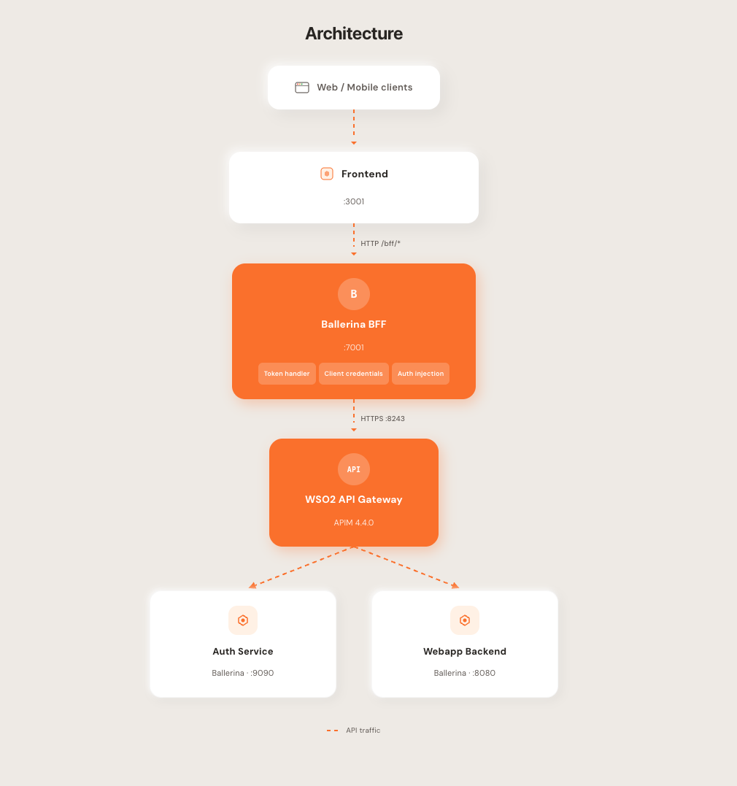
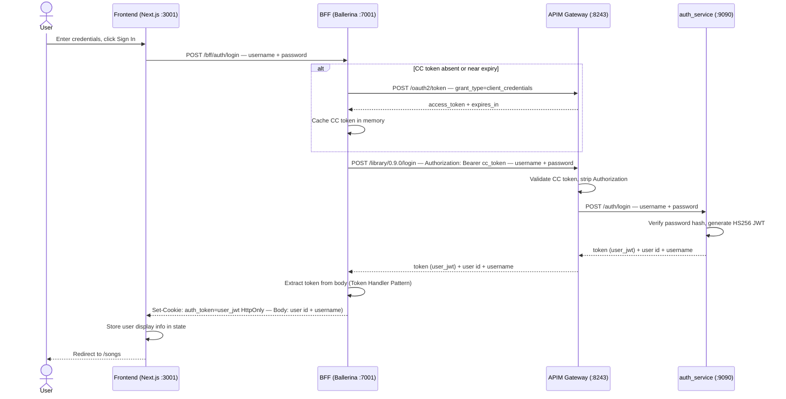
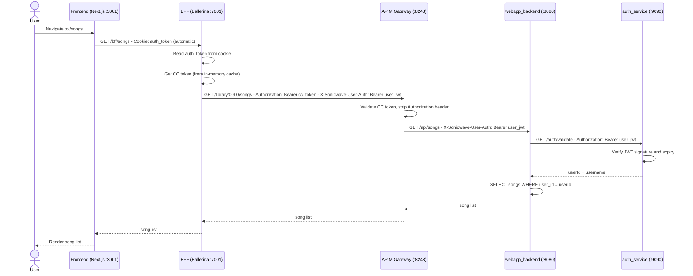

# SonicWave - BFF Pattern POC

A proof-of-concept demonstrating the **Backend for Frontend (BFF)** pattern. The application is a music library where users can register, log in, and manage their personal song collection.

The primary goal is to show how a dedicated BFF layer can sit between a browser-based frontend and an API gateway - handling authentication token management, APIM credential protection, and session security - without the frontend ever touching sensitive tokens or API manager credentials.

---

## What This POC Demonstrates

| Concern | How it is handled |
|---|---|
| APIM credentials in the browser | They are not. Credentials live only in `bff_layer/Config.toml` |
| User JWT exposure to XSS | Token is stored in an `HttpOnly` cookie, invisible to JavaScript |
| CSRF protection | `SameSite=Strict` cookie attribute |
| Dual-token APIM flow | BFF injects CC token + user JWT as separate headers |
| Stateless session scaling | Cookie carries the JWT itself - no server-side session store needed |

---

## Architecture



### Service map

| Service | Port | Technology |
|---|---|---|
| Frontend | 3001 | Next.js 16 |
| BFF | 7001 | Ballerina 2201.13.2 |
| APIM Gateway | 8243 | WSO2 API Manager 4.4.0 |
| APIM Management | 9443 | WSO2 API Manager 4.4.0 |
| auth_service | 9090 | Ballerina 2201.13.1, SQLite |
| webapp_backend | 8080 | Ballerina 2201.13.1, SQLite |

---

## Key Components

### Frontend - `frontend/`

A Next.js application with two responsibilities:

1. **Serve the React UI** - pages for login, register, song list, song detail, and add song
2. **Proxy `/bff/*` to the BFF** via a single Next.js rewrite rule in `next.config.ts`

### BFF - `bff_layer/`

The BFF is the security and protocol adapter. Its responsibilities are:

**Credential custody**
`apimClientId` and `apimClientSecret` are loaded from `Config.toml` at startup and never forwarded to the browser under any circumstances.

**CC token management**
On the first request (or when the cached token is near expiry), the BFF calls `POST /oauth2/token` on the APIM key manager with a Client Credentials grant. The resulting APIM JWT is cached in-process with a 60-second safety margin. All downstream calls include this token in `Authorization`.

**Token Handler Pattern**
On login and register, the BFF receives `{ token, user }` from auth_service via APIM. It takes the JWT out of the response body, places it in an `HttpOnly; SameSite=Strict` cookie, and returns only `{ user }` to the browser. From this point the token is inaccessible to JavaScript.

**Header injection**
On every authenticated request, the BFF reads the `auth_token` cookie and forwards two headers to APIM:
- `Authorization: Bearer <apim_cc_token>` - proves the application is subscribed
- `X-Sonicwave-User-Auth: Bearer <user_jwt>` - proves the user's identity

### APIM - `apim/wso2am-4.4.0/`

A single **MusicLibrary API Product** at context `/library/0.9.0` aggregates both backend services. The APIM gateway validates the CC token in `Authorization`, strips it (so backends never see APIM internals), and forwards all other headers - including `X-Sonicwave-User-Auth` - to the appropriate backend.

### auth_service - `backend/auth_service/`

Handles user registration, login, and JWT validation. Issues HS256 JWTs with a 24-hour TTL. The `/auth/validate` endpoint reads `X-Sonicwave-User-Auth` first (APIM flow, where `Authorization` has been stripped) and falls back to `Authorization` (direct service-to-service calls), making it compatible with both flows without code duplication.

### webapp_backend - `backend/webapp_backend/`

Manages song CRUD against a SQLite database. Every operation is scoped to the authenticated user: songs are owned, and a user can only list, view, and create their own songs. Auth is delegated to auth_service via the same dual-header resolution.

---

## Token & Cookie Design

### Why two tokens?

APIM and auth_service use incompatible JWT formats - different issuers and different signing keys. Neither can validate the other's token. Two separate headers let each layer validate only what it owns:

| Token | Issued by | Validated by | Purpose |
|---|---|---|---|
| APIM CC JWT (RS256) | APIM `/oauth2/token` | APIM gateway | Proves the app is subscribed; enables rate limiting |
| User JWT (HS256) | auth_service | auth_service `/validate` | Carries `userId`; scopes songs to the caller |

### Token Handler Pattern (THP)

The BFF never creates its own JWT and never inspects the JWT content. After a successful login it receives the auth_service JWT in the response body, intercepts it, and stores it in an `HttpOnly` cookie. JavaScript has zero access to the token from that point.

```
BFF response to browser on login:

  HTTP/1.1 200 OK
  Set-Cookie: auth_token=<jwt>; Path=/bff; Max-Age=86400; HttpOnly
  Content-Type: application/json

  { "user": { "id": "3", "username": "alice" } }
                ↑ token is NOT in the body
```

---

## Sequence Diagrams

### Login flow



### Song viewing flow



---

## Prerequisites

| Tool | Version | Notes |
|---|---|---|
| [Node.js](https://nodejs.org/) | v22+ | Frontend runtime |
| [Ballerina](https://ballerina.io/downloads/) | 2201.13.x (Swan Lake Update 13) | BFF + backend services |
| Java | 21 | Required by APIM and Ballerina |
| macOS or Linux | - | `setup.sh` uses bash |
| `python3` | 3.x | Pre-installed on macOS and most Linux distros |
| `lsof` | any | Pre-installed on macOS; Ubuntu: `sudo apt install lsof` |


### Frontend dependencies

```bash
cd frontend
npm install
```

---

## Running the Application

`setup.sh` handles everything — APIM provisioning on first run, then starting all services.

### First run

```bash
chmod +x setup.sh

# Option A — provide a local pack
./setup.sh --pack /path/to/wso2am-4.4.0.zip

# Option B — no pack available: the script downloads one automatically
./setup.sh
```

> **Option B requires WSO2 VPN.** The pack is downloaded from `atuwa.private.wso2.com`, which is only reachable on the WSO2 internal network. The script will pause and ask you to confirm before downloading.

On first run `setup.sh` automatically:

| Step | Action |
|---|---|
| 1 | Extracts the APIM zip to `apim/` |
| 2 | Patches `deployment.toml` to allow `X-Sonicwave-User-Auth` through CORS |
| 3 | Starts APIM and waits until the REST API is reachable (up to 5 minutes) |
| 4 | Creates **SonicwaveAuth API** (routes to `auth_service :9090`) |
| 5 | Creates **SonicwaveSongs API** (routes to `webapp_backend :8080`) |
| 6 | Deploys and publishes both APIs to the Default gateway |
| 7 | Creates **MusicLibrary API Product** at `/library/0.9.0` |
| 8 | Creates **LibraryApplication**, subscribes it, and generates PRODUCTION OAuth keys |
| 9 | Writes `consumerKey` / `consumerSecret` into `bff_layer/Config.toml` and `bff_layer/config.bal` |
| 10 | Continues directly to start all services — no restart needed |

A `.sonicwave_configured` marker is written inside the APIM directory so provisioning is never repeated.

### Subsequent runs

```bash
./setup.sh
```

Starts APIM normally (skips provisioning) then starts all other services.

### Startup order

1. **APIM** — provisioned (first run) or started from existing config
2. **auth_service**, **webapp_backend**, **BFF** — started in parallel
3. **10 second wait** — services compile and bind ports
4. **Frontend** — `npm run dev`

Once ready, the banner prints all URLs:

```
━━━━━━━━━━━━━━━━━━━━━━━━━━━━━━━━━━━━━━━━━━━━━━━━━━━
  SonicWave is ready

  UI          →  http://localhost:3001
  BFF         →  http://localhost:7001/bff
  APIM Portal →  https://localhost:9443/devportal
━━━━━━━━━━━━━━━━━━━━━━━━━━━━━━━━━━━━━━━━━━━━━━━━━━━
```

Logs are written to `*.log` files in the project root. Press **Ctrl+C** to stop all services cleanly.

---

## Repository Structure

```
BFF-POC/
├── setup.sh                   # One-command startup (provisions APIM on first run)
├── APIM.md                    # APIM configuration reference
├── BFF_Plan.md                # BFF design decisions & plan
│
├── bff_layer/                 # Ballerina BFF service (:7001)
│   ├── main.bal               # HTTP listener + service definition
│   ├── config.bal             # Configurable variable declarations
│   ├── Config.toml            # Runtime values (APIM credentials)
│   ├── types.bal              # Shared record types
│   ├── connections.bal        # APIM HTTP clients (TLS skip in dev)
│   ├── cookie.bal             # httpOnly cookie read/set/clear helpers
│   └── functions.bal          # CC token cache + all request handlers
│
├── backend/
│   ├── auth_service/          # Ballerina auth service (:9090)
│   └── webapp_backend/        # Ballerina songs API (:8080)
│
├── frontend/           # Next.js frontend (:3001)
│   ├── src/
│   │   ├── app/               # Next.js App Router pages
│   │   ├── components/        # Navigation, ProtectedRoute, etc.
│   │   ├── context/           # AuthContext (cookie-based, no token in state)
│   │   ├── lib/api.ts         # Entire API client — 60 lines, no token logic
│   │   └── types/             # TypeScript interfaces
│   ├── next.config.ts         # Single rewrite: /bff/* → BFF :7001
│   └── .env                   # BFF_URL only — no secrets
│
└── apim/
    └── wso2am-4.4.0/          # Pre-configured APIM instance
```